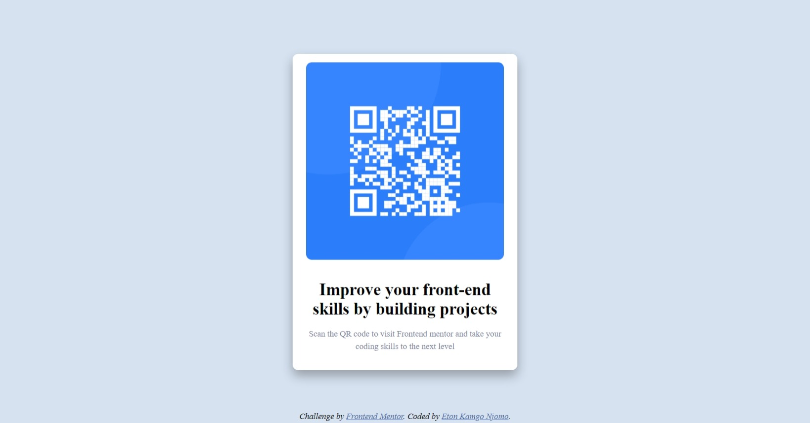

# Frontend Mentor - QR code component solution

This is a solution to the [QR code component challenge on Frontend Mentor](https://www.frontendmentor.io/challenges/qr-code-component-iux_sIO_H). Frontend Mentor challenges help you improve your coding skills by building realistic projects.

## Table of contents

- [Frontend Mentor - QR code component solution](#frontend-mentor---qr-code-component-solution)
  - [Table of contents](#table-of-contents)
  - [Overview](#overview)
    - [Screenshot](#screenshot)
    - [Links](#links)
  - [My process](#my-process)
    - [Built with](#built-with)
    - [What I learned](#what-i-learned)
  - [Author](#author)

**Note: Delete this note and update the table of contents based on what sections you keep.**

## Overview

### Screenshot

### Links

- Solution URL: [Click to visit solution](https://github.com/kelton-glitch/kelton-glitch.github.io.git)
- Live Site URL: [Click to see live site](https://kelton-glitch.github.io)

## My process

### Built with

- Semantic HTML5 markup
- CSS custom properties

### What I learned

Learnt to play around with divs and position them in a way tht is easy to follow and understnad

## Author

- Website - [kelton-glitch](https://www.github.com/kelton-glitch)
- Frontend Mentor - [@kelton-glitch](https://www.frontendmentor.io/profile/kelton-glitch)
- Twitter - [@kelton194](https://www.twitter.com/kelton194)
